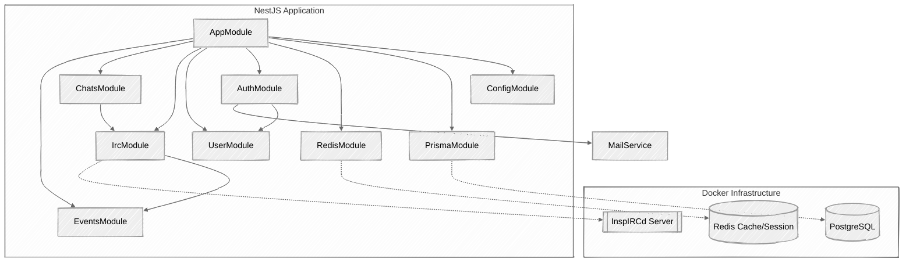
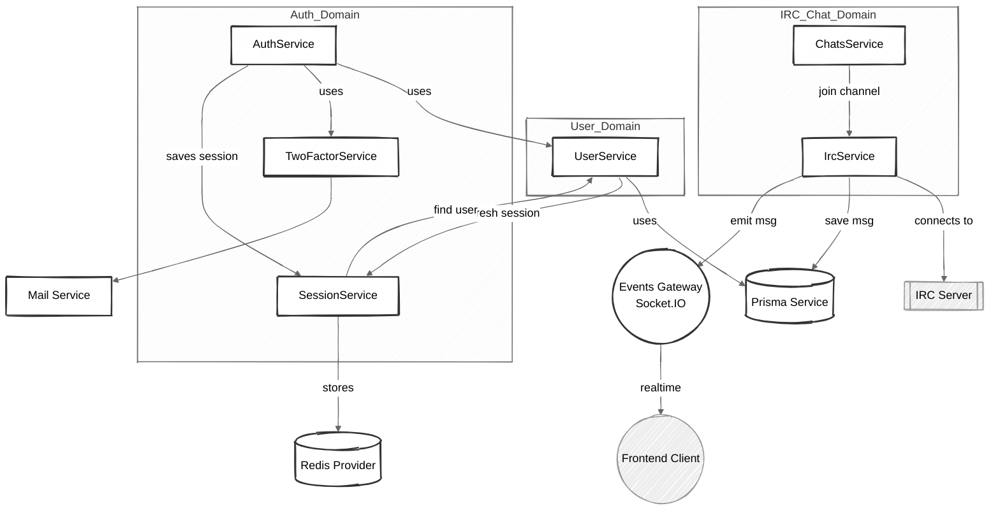
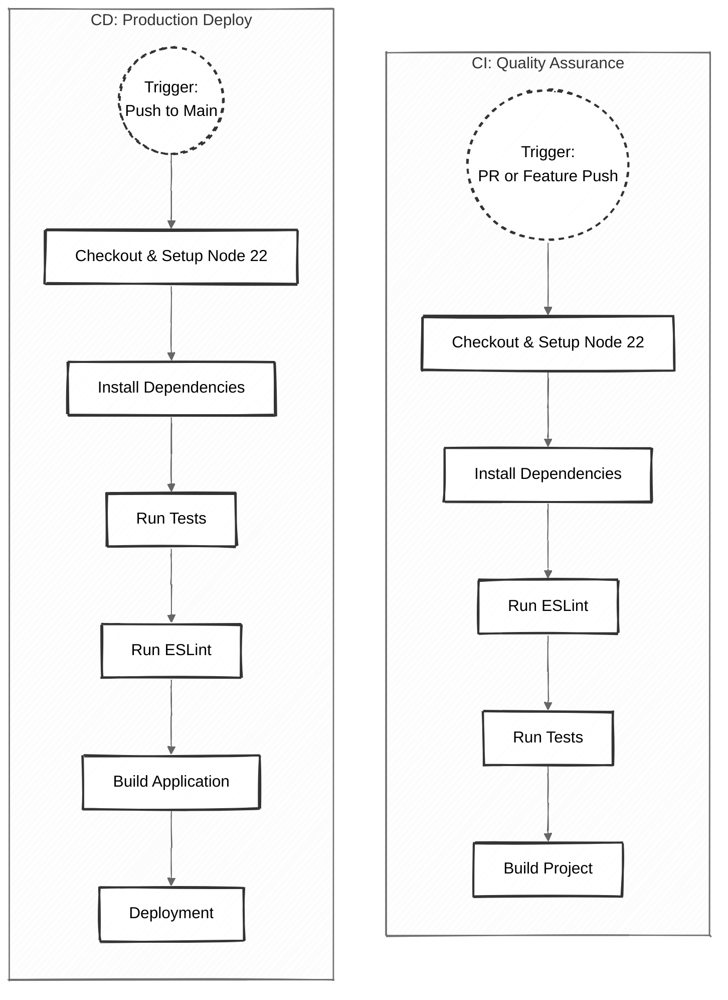
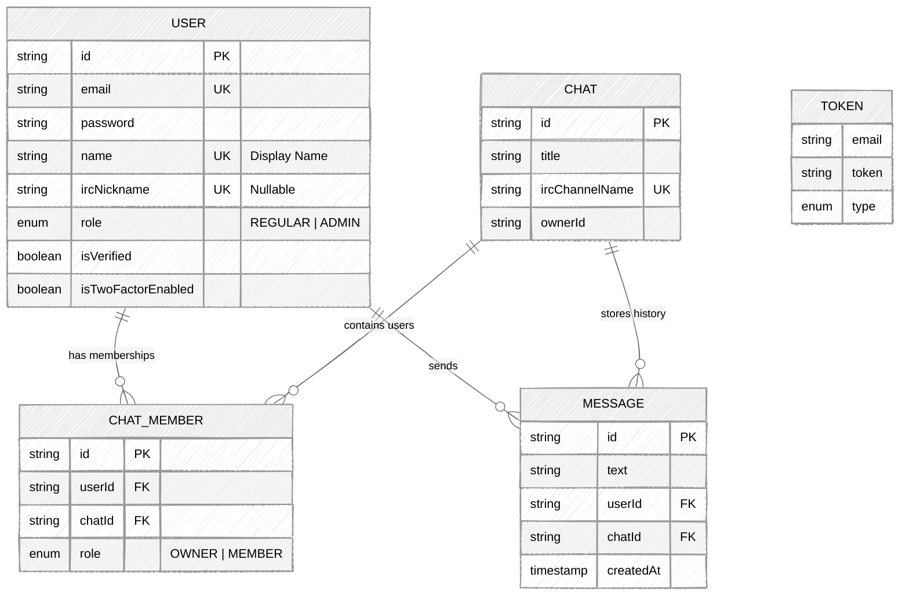
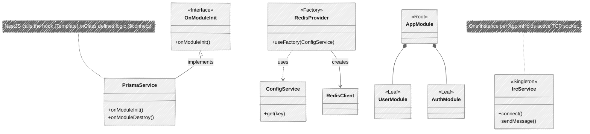

# IRC Client - Backend

This repository contains the backend infrastructure and API for the "IRC Client" project. It consists of a containerized environment (PostgreSQL, Redis, InspIRCd) and a NestJS-based API application.

---

## 🛠 Tech Stack
- **Framework:** NestJS 11
- **Database:** PostgreSQL (via Prisma ORM)
- **Caching & Sessions:** Redis (ioredis, connect-redis)
- **Real-time:** Socket.IO
- **IRC:** irc-framework (InspIRCd)

---

## 🏗 Project Architecture

### 1. High-Level Module Structure
The following diagram illustrates the modular architecture of the NestJS application. The **AppModule** acts as the root orchestrator, connecting feature modules (like Auth, Chat, IRC) with infrastructure modules (Config, Prisma, Redis).



### 2. Service Dependencies & Data Flow
This detailed view maps the interactions between specific services.
- Bridge Pattern: The **`IrcService`** acts as a bridge, receiving messages from the IRC Server, saving them to PostgreSQL via **`PrismaService`**, and broadcasting them to the Frontend via **`EventsGateway`**.
- Auth Flow: **`AuthService`** orchestrates **`UserService`** (data), **`SessionService`** (Redis sessions), and **`MailService`** (Notifications).


---

## 🔄 CI/CD Pipelines

Automated pipelines are configured using GitHub Actions to ensure code quality and streamline deployment.

### Pipeline Workflows
1.  **CI - Quality Assurance**: Triggered on Pull Requests to `main` or pushes to feature branches. It verifies that the code is clean, linted, and compiles correctly.
2.  **CD - Production Deploy**: Triggered only when code is merged/pushed to `main`. It runs final checks and simulates a deployment.



## 💾 Database Schema

The project uses **PostgreSQL** managed by **Prisma ORM**. Below is the Entity-Relationship Diagram (ERD) representing the data structure.

### Entity Relationship Diagram



### Models Description

| Model | Description | Key Fields |
| :--- | :--- | :--- |
| **User** | Represents the application user. Stores authentication credentials and profile settings. | `email`, `password` (hashed), `ircNickname` (mapped to IRC server), `isTwoFactorEnabled`. |
| **Chat** | Represents a chat room (channel). Linked 1:1 with an IRC channel. | `ircChannelName` (Unique identifier on IRC), `ownerId`. |
| **ChatMember** | A pivot table handling the **Many-to-Many** relationship between Users and Chats. | `role` (Defines if user is MEMBER or OWNER of the chat). |
| **Message** | Stores the chat history. Messages are synced from IRC to this table. | `text`, `createdAt`. |
| **Token** | Temporary tokens for security flows. Not directly linked to User ID, but via Email. | `type` (VERIFICATION, TWO_FACTOR, PASSWORD_RESET), `expiresIn`. |

### Enums

- **UserRole**: `REGULAR`, `ADMIN` (Controls access to API endpoints).
- **ChatRole**: `MEMBER`, `OWNER` (Permissions within a specific chat).
- **TokenType**: `VERIFICATION`, `TWO_FACTOR`, `PASSWORD_RESET`.

## 🧩 Design Patterns Implementation

The project architecture consists of the following patterns:

### 1. Client-Server
**Where:** The entire architecture.
**How:** The system is divided into the **Server** (NestJS API, PostgreSQL, Redis) and **Clients** (Swift App - Frontend). They communicate via HTTP (REST) and WebSockets/TCP.

### 2. Singleton
**Where:** All Services (`UserService`, `IrcService`, `AuthService`, etc.).
**How:** NestJS relies on **Dependency Injection**. By default, providers are Singletons.
* **Example:** The `IrcService` is created once. It maintains a *single persistent TCP connection* to the IRC server. If we injected a new instance every time, we would flood the server with connections.

### 3. Factory Method (Abstract Factory approach)
**Where:** `src/libs/redis/redis.provider.ts`
**How:** We use the `useFactory` syntax to dynamically create and configure the Redis client.
* **Logic:** The factory function takes the `ConfigService` as an input, reads the environment variables, and constructs the complex Redis client object. This abstracts the creation logic from the rest of the app.

### 4. Template Method
**Where:** `PrismaService` and `IrcService`.
**How:** We implement the `OnModuleInit` and `OnModuleDestroy` interfaces.
* **Logic:** NestJS defines the "skeleton" of the application lifecycle (Start -> Init -> Run -> Destroy). Our classes provide the specific implementation for the `onModuleInit` step (e.g., `$connect()` to DB or `connect()` to IRC).

### 5. Composite
**Where:** NestJS Module System (`AppModule`).
**How:** The application is a tree of modules. `AppModule` (Root) imports `AuthModule`, `UserModule`, etc. These modules can import other modules (e.g., `RedisModule`). The DI container traverses this tree to resolve dependencies, treating individual modules and groups of modules uniformly.

### Visual Representation of Patterns



---

## 📂 Project Structure

- **`src`**: Contains the main backend application built with **NestJS**. This is where the business logic, database interactions (Prisma), and API endpoints reside.
- **`config`**: This directory contains configuration files for the **InspIRCd** server.
- **`docker-compose.yaml`**: Defines the infrastructure services required to run the project.

---

## 🚀 Infrastructure (Docker)

The project uses Docker Compose to spin up the necessary databases and the IRC server.

### Prerequisites
- Docker & Docker Compose installed.

### Environment Variables (Root)
Create a `.env` file in the **root** directory to configure Docker services.

| Variable | Default Value | Description |
| :--- | :--- | :--- |
| `POSTGRES_USER` | `postgres` | Database superuser. |
| `POSTGRES_PASSWORD` | `password` | Database password. |
| `POSTGRES_DB` | `trpz-db` | Name of the default database. |
| `REDIS_PASSWORD` | `password` | Password for Redis authentication. |

### Running the Infrastructure
To start the database, cache, and IRC server, run:
```bash
  docker compose up -d
```

### Services & Ports

| Service | Container Name | Internal Port | **Host Port (External)** | Description |
| :--- | :--- | :--- | :--- | :--- |
| **PostgreSQL** | `trpz-db` | 5432 | **54321** | Main relational database. |
| **Redis** | `trpz-redis` | 6379 | **63798** | Key-value store for caching and sessions. |
| **InspIRCd** | `trpz-irc` | 6667 | **6660-6669** | IRC Chat Server. |

---

## 💻 API Application

The API is located in the `api` folder.

### Setup
1. Navigate to the api folder:
   ```bash
   cd api
   ```

2. Install dependencies:
   ```bash
   npm install
   ```

### Environment Variables (API)

The `.env` file inside the **api** folder contains environment variables used for configuring the application:

| Variable               | Description                                                   |
|------------------------|---------------------------------------------------------------|
| `NODE_ENV`             | Environment mode (development, production).                   |
| `APP_IP`               | Application IP address.                                       |
| `APPLICATION_PORT`     | Application port.                                             |
| `FRONTEND_PORT`        | Frontend port for CORS configuration.                         |
| `APPLICATION_URL`      | Full URL to access the API.                                   |
| `ALLOWED_ORIGIN`       | URL to allow CORS.                                            |
| `COOKIES_SECRET`       | Secret key for cookie encryption.                             |
| `SESSION_SECRET`       | Secret key for session management.                            |
| `SESSION_NAME`         | Name of the session cookie.                                   |
| `SESSION_DOMAIN`       | Domain for the session.                                       |
| `SESSION_MAX_AGE`      | Max age for session cookies.                                  |
| `SESSION_HTTP_ONLY`    | Flag to make session cookies HTTP-only.                       |
| `SESSION_SECURE`       | Flag to secure the session cookie (use `true` in production). |
| `SESSION_FOLDER`       | Folder for storing session data.                              |
| `POSTGRES_USER`        | PostgreSQL user.                                              |
| `POSTGRES_PASSWORD`    | PostgreSQL password.                                          |
| `POSTGRES_HOST`        | PostgreSQL host.                                              |
| `POSTGRES_PORT`        | PostgreSQL port.                                              |
| `POSTGRES_DB`          | PostgreSQL database name.                                     |
| `POSTGRES_URI`         | PostgreSQL connection URI.                                    |
| `REDIS_USER`           | Redis user.                                                   |
| `REDIS_PASSWORD`       | Redis password.                                               |
| `REDIS_HOST`           | Redis host.                                                   |
| `REDIS_PORT`           | Redis port.                                                   |
| `REDIS_URI`            | Redis connection URI.                                         |
| `IRC_HOST`             | IRC server host (e.g. localhost).                             |
| `IRC_PORT`             | IRC connection port.                                          |
| `IRC_NICK`             | Bot's nickname in chat.                                       |
| `IRC_USERNAME`         | Username used for IRC identification (ident).                 |
| `IRC_CHANNEL`          | Default channel to join on startup.                           |
| `MAIL_HOST`            | SMTP server hostname.                                         |
| `MAIL_PORT`            | SMTP server port.                                             |
| `MAIL_SECURE`          | Use SSL/TLS encryption (true/false).                          |
| `MAIL_LOGIN`           | SMTP username/email for authentication.                       |
| `MAIL_PASSWORD`        | SMTP password (or app-specific password).                     |
| `MAIL_FROM`            | Sender email address.                                         |

### Environment Variables (Root)

In the **root** directory, create a `.env` file to configure Docker services:

| Variable           | Description                             |
| ------------------ | --------------------------------------- |
| `POSTGRES_USER`    | Database superuser.                     |
| `POSTGRES_PASSWORD`| Database password.                      |
| `POSTGRES_DB`      | Name of the default database.           |
| `REDIS_PASSWORD`   | Password for Redis authentication.      |

### Running the Application

After setting up the `.env` files, follow these steps to run the application:

1. **Build the application**:
    ```bash
    yarn build
    ```

2. **Run in development mode** (with hot-reload):
    ```bash
    yarn start:dev
    ```

3. **Run in production mode**:
    ```bash
    yarn start:prod
    ```

4. **Run tests**:
    ```bash
    yarn test
    ```

5. **Run end-to-end tests**:
    ```bash
    yarn test:e2e
    ```

---

## 🧪 Testing with External IRC Client

To manually test the infrastructure and chat functionality, you can use any standard IRC client.

**Example using `irssi` (macOS/Linux):**


1. **Install irssi**:
   ```bash
   brew install irssi
    ```
2. **Connect to the Server**:
   Open your terminal and run `irssi`. Then, connect to your local IRC server:
   ```text
   /connect localhost 6667 -nick arsaide_432
   ```
3. **Join a Room**:
   Once connected, join the default channel:
   ```text
   /join #general
   ```

## Troubleshooting

### Error: `WARN [IrcService] IRC Connection closed`

If you see this error repeatedly, it is likely that the IRC server has banned your IP address due to "Excessive Connections" or Spam protection mechanisms.

**Solution 1: Wait**
The default ban time is usually around **6 hours**.

**Solution 2: Force Unban (Delete Ban Database)**
You can manually remove the ban database from the running container:

```bash
# Enter the container
docker exec -it trpz-irc sh

# Remove the XLine database (bans)
rm /inspircd/data/xline.db

# Exit the container
exit

# Restart the IRC service
docker restart trpz-irc
```

**Solution 3: Disable Ban Modules (Prevention)**
To prevent this from happening during development, you can disable the connection flood protection.

1. Open `/config/inspircd/modules.conf` in your project folder.
2. Comment out (or remove) the following lines:
```bash
  <module name="connectban">
  
  OR
  
  <module name="connflood">
```
3. Restart the IRC container.

## 📝 Notes

- Ensure that Docker is running and the `.env` files are correctly set before starting the services.

---

